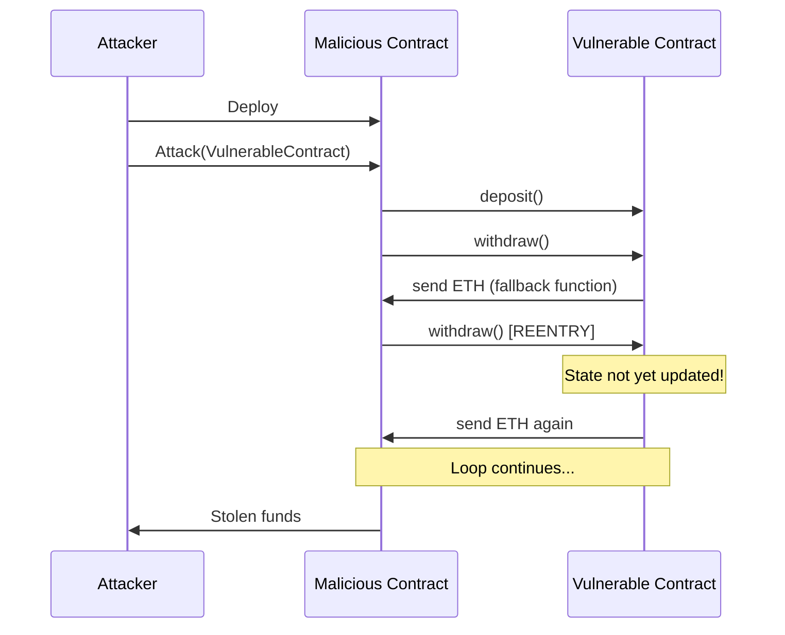

# Smart Contract Security - Reentrancy Attack 🛡️


## 🚨 Overview
A comprehensive, practical demonstration of the **reentrancy vulnerability** - one of the most notorious security flaws in smart contract development - and essential protection strategies to safeguard your contracts.

## 🔧 Technology Stack & Dependencies

| Technology | Purpose |
|------------|---------|
| **Solidity** | Writing secure Smart Contracts |
| **JavaScript** | Handling contract interactions |
| **[NodeJS](https://nodejs.org/en/)** | Creating Hardhat projects and managing dependencies |
| **[Ethers.js](https://docs.ethers.io/v5/)** | Interacting with blockchain contracts via JavaScript |

## 🚀 Getting Started

### 1. Clone/Download the Repository
```bash
git clone https://github.com/Cicada-3301Bank/Reentrancy-attack-Smart-Contract-Security.git
cd Reentrancy-attack-Smart-Contract-Security
```

### 2. Install Dependencies
```bash
npm install
```

### 3. Compile Smart Contracts
```bash
npx hardhat compile
```

### 4. Test and Perform Attack Simulation
```bash
npx hardhat test
```

## 📚 What You'll Learn

- Understanding the mechanics of reentrancy attacks
- Identifying vulnerable contract patterns
- Implementing protection measures:
  - Checks-Effects-Interactions pattern
  - ReentrancyGuard implementation
  - State management best practices

## 🔐 Security Best Practices

- ✅ Always update state variables before external calls
- ✅ Implement reentrancy guards for critical functions
- ✅ Use pull payment patterns instead of push where possible
- ✅ Apply the principle of least privilege

## 📊 Example Attack Flow



## 💡 Contributing

Contributions are welcome! Please feel free to submit a Pull Request.

## 📄 License

This project is licensed under the MIT License - see the LICENSE file for details.

---

<div align="center">
  <h3>⚠️ Educational Purposes Only ⚠️</h3>
  <p>This repository is intended for educational purposes to help developers understand and prevent security vulnerabilities.</p>
</div>
